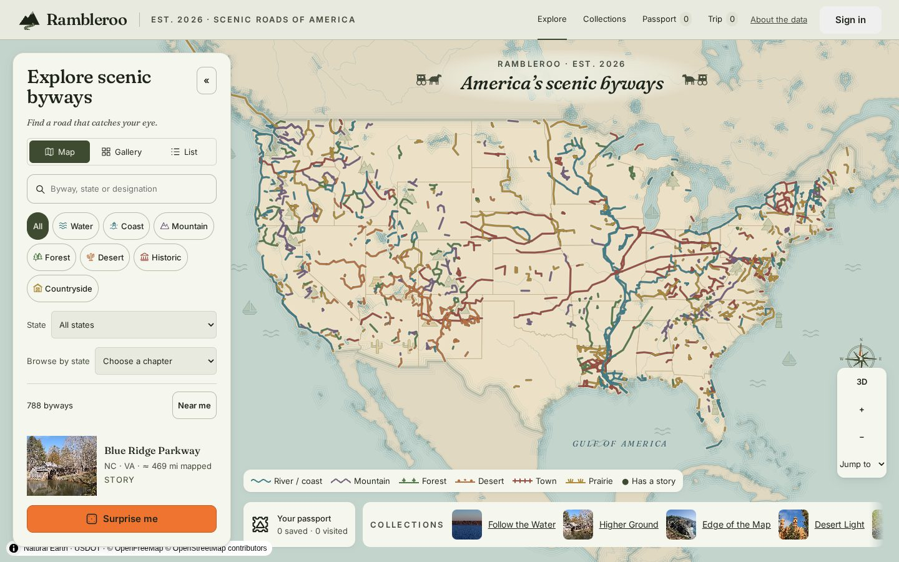
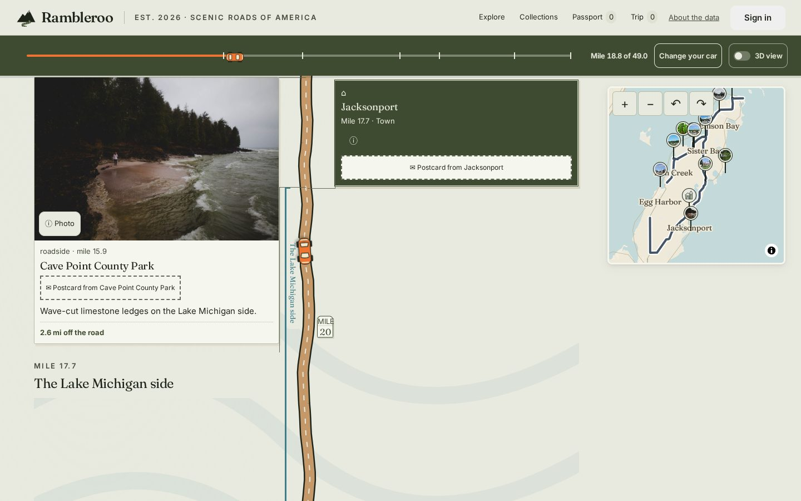
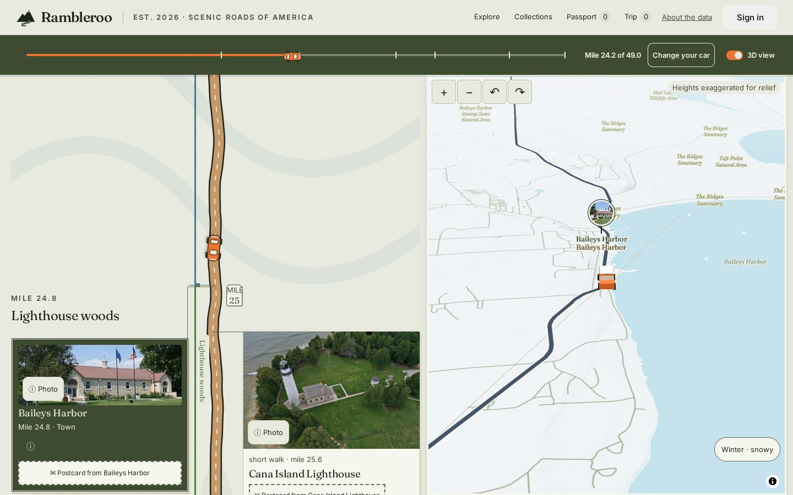
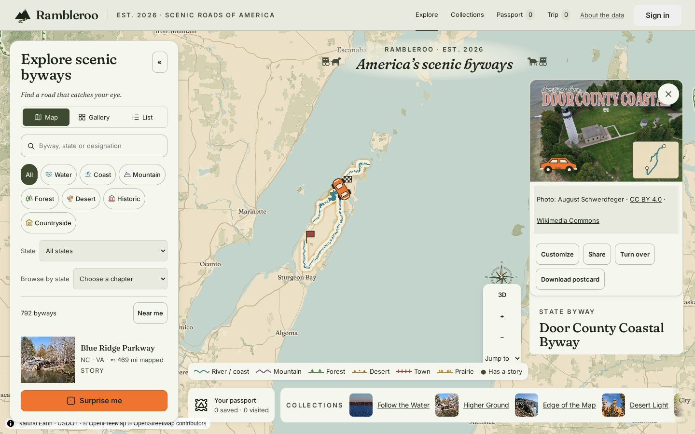
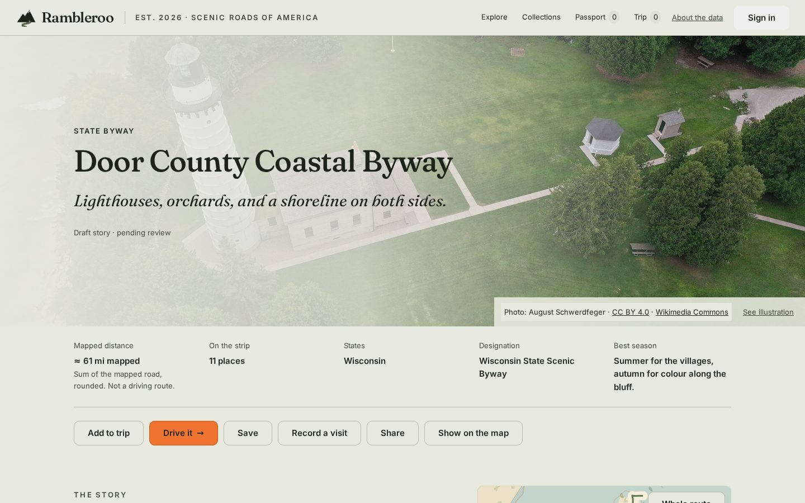
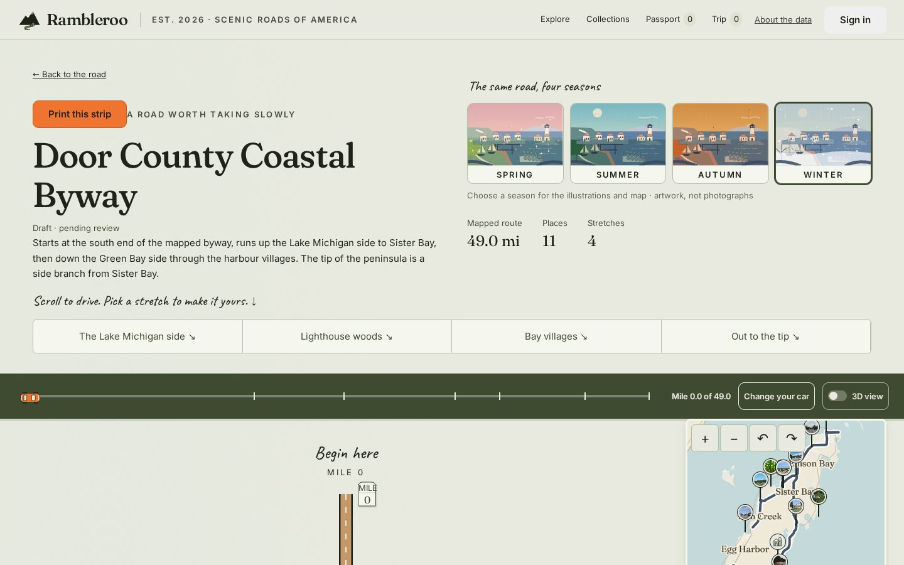
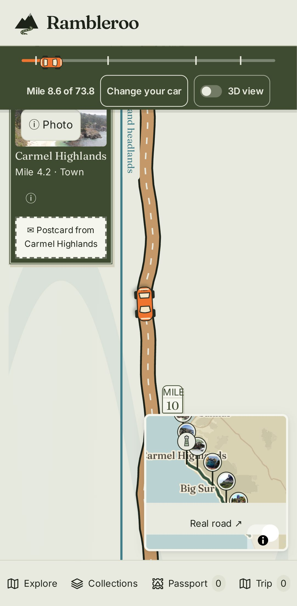

<p align="center"></p>

# Rambleroo

Drive into the heart of the American story. Rambleroo is a guide to nearly 800 scenic roads in the United States. Find a road on the national map, read its postcard, then scroll down the road mile by mile on a strip map. Save it, add it to a trip, record a visit and collect a stamp in your passport.

Open it at **https://rambleroo.app**. No account is needed. Rambleroo is a personal, noncommercial, open-source project, and [contributions are welcome](#contributing).



|  |  |
| ------------------------------------------------------------------------------------------------------------------------ | --------------------------------------------------------------------------------------------- |
| **Scroll to drive.** Towns and stops appear at their mile.                                                               | **3D view.** The camera follows your car over raised relief.                                  |

<!--
|                                                                                                                                                  |                                                                                                                               |
| ------------------------------------------------------------------------------------------------------------------------------------------------ | ----------------------------------------------------------------------------------------------------------------------------- |
|                                        |  |
| **Explore.** Every road on one pictorial map, filtered by theme or state.                                                                        | **Pick a road.** It traces itself on the map and its postcard opens, photo credit included.                                   |
|  |                |
| **Road page.** The facts, where they come from, and a Drive it button.                                                                           | **Strip map.** The same road in four seasons, then the drive.                                                                 |
|      |                                  |
| **Scroll to drive.** Towns and stops appear at their mile.                                                                                       | **3D view.** The camera follows your car over raised relief.                                                                  |


<p align="center"></p>
-->

## What's on the map

Rambleroo catalogs **792 scenic drives across the United States**, combining federal layers, state DOT registries, and iconic routes:

- **778 National & State Scenic Byways** from the USDOT National Scenic Byways layer (June 2022).
- **6 State Additions** sourced directly from Wisconsin DOT and Florida DOT route GIS layers to patch federal gaps.
- **8 Unofficial Classics** (e.g., _Going-to-the-Sun Road_, _Road to Hana_) labeled explicitly as un-designated classic routes.

### Features

- **Linear Strip Maps (721 routes):** Each corridor unrolls into a continuous linear ribbon as you scroll. Towns, natural landmarks, and scenic overlooks are pinned to their true relative milepost. Drive times are dynamically routed via OpenStreetMap, while data discontinuities render as dashed connector lines.
- **Four-Season Visuals & Custom Postcards:** Every route features a procedural postcard and seasonal strip illustrations. For 113 roads, 159 human-verified, freely licensed photographs provide authentic field references.
- **Granular Designations:** Instantly differentiate between _All-American Roads_, _National Scenic Byways_, _State Scenic Byways_, and _National Forest Byways_, with direct links to respective state agency programs.

### Cartographic & Data Integrity

Rambleroo prioritizes ground truth and transparency over smoothed assumptions:

- **Mapped Miles vs. Driving Distance:** Mileage is calculated directly along mapped geometry rather than odometer estimates. Divided segments are summed as drawn.
- **Explicit Discontinuities:** Gaps in source GIS layers remain visible as breaks—no synthetic route interpolation without indication.
- **Clear Provenance:** Generated artwork, verified photographs, and work-in-progress routes carry clear state labels (`Illustration · no photo yet`, `Draft · pending review`).
- **Open Source & Agency Attribution:** Sourced with attribution from USDOT, WisDOT, FDOT, Natural Earth, OpenStreetMap, Wikipedia, and Wikimedia Commons. See [docs/licensing.md](docs/licensing.md) for full attribution schemas.

## What you can do

| View                             | Path                           | What you'll find                                                                                                                |
| -------------------------------- | ------------------------------ | ------------------------------------------------------------------------------------------------------------------------------- |
| **National map**                 | `/`                            | Every road on one pictorial map, with gallery and list views; filters and selection live in the URL, so any view can be shared. |
| **Road page**                    | `/byway/:id`                   | Mapped distance, designation, photo and story, signature stops along the way, and directions to the road.                       |
| **Strip map**                    | `/byway/:id/strip`             | The road as a ribbon you scroll mile by mile, in four seasons, with a 3D view and a printable version (`/print`).               |
| **Trip**                         | `/trip`                        | Roads in the order you want to drive them, with mapped miles, drive times and Google Maps links.                                |
| **Passport**                     | `/passport`                    | Saved roads, visits, stamps, your postcards and your car; share a trip or passport as a read-only link (`/s/:slug`).            |
| **State chapters & collections** | `/state/:code`, `/collections` | Each state's byway program with links to its agency (Wisconsin and Florida so far), and editorial collections.                  |

## Run it locally

You need Node 22.13 or later.

```bash
npm install
npm run dev          # http://localhost:5173
npm test             # vitest: domain logic, stores, components, the Worker, and the data-quality checks
npm run test:e2e     # playwright: explore, story, save, visit, passport, strip maps, trips and sharing
npm run build        # typecheck and production build into dist/
```

Playwright needs its browsers once: `npx playwright install chromium webkit`. The e2e suite runs as desktop Chrome, a Pixel 7 and an iPhone 13 (WebKit), and on phones it fails any page that scrolls sideways, has a tap target under 40px or text under 12px.

The offline app only runs in a production build, so try it with `npm run build && npm run preview`. To open the dev server from a phone on the same network, use `npm run dev:phone`.

### Tech Stack

- **Frontend:** React 19, React Router, Vite, Zustand
- **Cartography & Rendering:** MapLibre GL, three.js
- **Backend & Edge:** Cloudflare Workers, Cloudflare D1 (SQL), Cloudflare R2 (Object Storage)
- **Auth:** Better Auth

## Data

The display data in `public/data/` is built from source snapshots by scripts you can rerun.

```bash
npm run ingest:fetch                          # snapshots into data/raw/ (USDOT byway layer, Natural Earth), with a manifest and sha256
npx tsx scripts/ingest/build-supplements.ts  # roads missing from the national layer (content/state-sources.json) and classic drives (content/classics.json)
npm run ingest:build                          # normalise into public/data/ (catalog.json, byways.geojson, basemap/)
npm run strips:build -- <bywayId>             # build one road's strip map
```

- **Byway lines:** the USDOT-hosted `Scenic_Byways_2022_06_24` ArcGIS layer. Its 3,427 segments are dissolved by `BYWAY_ID` into 778 byways and simplified for display. Parts are never bridged.
- **Distances** sum the source `LENGTH` field (miles) over mapped segments. Multi-state roads get per-state mileage by segment midpoint.
- **Roads beyond the national layer** come from state GIS layers listed in `content/state-sources.json` (Wisconsin and Florida so far). Classic drives are routed through Wikipedia and Wikidata waypoints with OSRM on OpenStreetMap data, and the build fails if a route doesn't use the road the drive is named for.
- **Strip maps** (`scripts/strips/`) order towns and stops by their true mile along the road and route drive times with OSRM once, at build time.
- **Themes** are inferred from road names (`scripts/ingest/classify.ts`) unless `content/overrides.json` sets them by hand.
- **Basemap:** Natural Earth 1:50m (public domain) is bundled for the national view. Closer in, detail comes from OpenFreeMap vector tiles. Neither needs an API key.
- **Photos** are proposed by `scripts/photos/discover.ts` from Wikipedia lead images and the U.S. DOT America's Byways collection on Commons, or picked by hand from a wider Commons search for a state chapter. Every one is reviewed by a person and published with `scripts/photos/fetch.ts` into `public/photos/` and `content/photos.json`.
- **Editorial content** lives in `content/`: stories, strip text, collections, state chapters and overrides. `scripts/ingest/content.test.ts` fails the tests if content points at a road that doesn't exist.

Known gaps: the Ohio River Scenic Byway's mileage can't all be assigned to a state, because many of its segment midpoints fall in the river. State chapter links are checked by hand with `npx tsx scripts/states/check-links.ts`, which reports failed URLs and redirects to another host.

## Layout

```text
content/            stories, strip text, collections, state chapters, photo credits, overrides
data/raw/           source snapshots (gitignored except manifest.json)
public/data/        built display data served to the app
public/photos/      published, credited photographs
scripts/ingest/     fetch, normalise, classify, data-quality tests
scripts/strips/     strip map discovery, building and repair
scripts/photos/     photo discovery and publishing
scripts/states/     state sources and the chapter link checker
src/components/art  illustration kit: Scene, Stamp, Seal, Compass, Logo, Vehicle
src/components/ui   Dialog, Toast, RouteMap, shared content blocks
src/features/       one folder per area: explore, map, byway, strip, trip, state, collections, passport, postcard, garage, share, account, about, legal
src/lib/            types, data hooks, filters, formatting, stores, account and photo sync
worker/             the Cloudflare Worker: auth, account data, photos, shares
migrations/         D1 schema
tests/e2e/          Playwright suites
```

## Accounts and running your own copy

Accounts are optional. Sign in with Google, an emailed link or a passkey, and your passport, trip, car and postcards sync across devices (Better Auth on Cloudflare D1, with photos in R2).

- [Local development](docs/local-development.md): running the Worker and sign-in locally, how sync behaves, and the manual checks for account changes.
- [Deploying your own copy](docs/deployment.md): Cloudflare, Google OAuth, Resend and Turnstile setup.

## Contributing

The most useful help is often a correction: a road drawn wrong, a place in the wrong spot, a photo credit. [Open an issue](https://github.com/raynbowy23/rambleroo/issues/new/choose) for those, for bugs, and for ideas. Pull requests for fixes are welcome; [CONTRIBUTING.md](CONTRIBUTING.md) lists the checks CI runs.

The next big piece of work is [state chapters](docs/state-coverage.md): every state's byway program, linked to the agency that designates its roads and mapped as fully as Wisconsin and Florida are. The plan has a status table for all 50 states, and each one is a self-contained project for a contributor. Pick a state with the [State chapter](https://github.com/raynbowy23/rambleroo/issues/new?template=state-chapter.yml) issue template.

Please report security problems privately, as described in [SECURITY.md](SECURITY.md).

## Licence

Code is [MIT](LICENSE). Written content is CC BY-NC 4.0, and third-party data and media keep their own terms; [docs/licensing.md](docs/licensing.md) sets out which is which.
